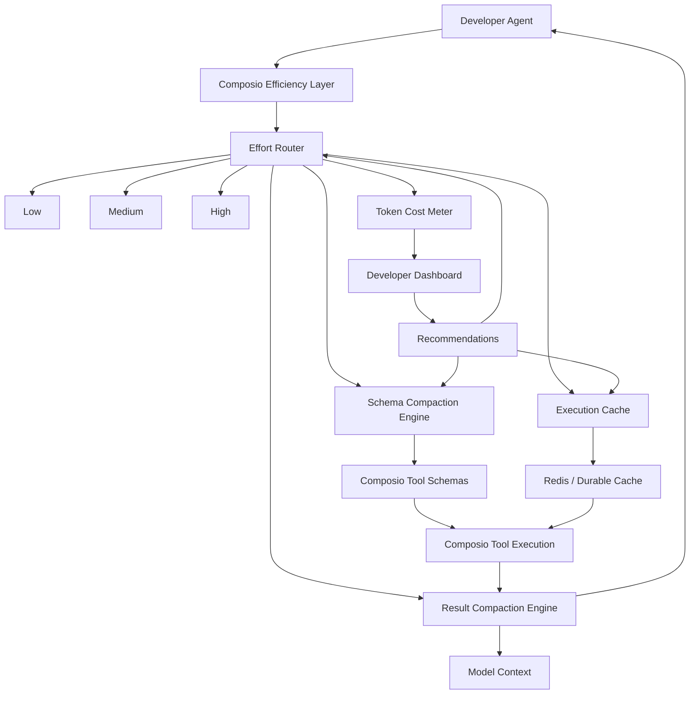
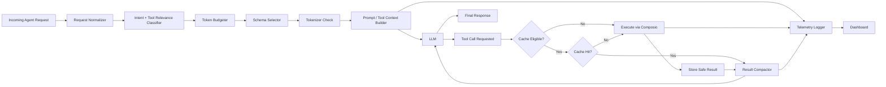

# Composio Token Efficiency Layer

**Working name:** Composio Efficiency Layer  
**One-line thesis:** Give developers a control plane for how much tool context, execution, and result detail an agent is allowed to spend.

## 1. The plain-English problem

AI agents are getting expensive in a weird, hidden way.

It is not only the model response that costs tokens. The agent also spends tokens reading tool schemas, tool descriptions, arguments, tool results, retry traces, and repeated context that may not matter for the task.

Composio is already strong at the tooling layer. It connects agents to apps, handles auth, exposes tools, and lets agents execute actions across many services.

The gap you are pointing at is this:

> Developers do not have a clear, user-facing way to see, control, and reduce the token cost of the tooling layer.

In simpler terms:

> The agent is often handed the whole toolbox when it only needs a screwdriver. Then it sometimes asks for the same screwdriver again, pays to read the label again, and may even re-run the same safe lookup again.

Your product is the layer that says:

1. What tool context did we give the model?
2. How many tokens did that cost?
3. Was the tool execution actually necessary?
4. Could the schema have been smaller?
5. Could the result have been reused safely?
6. What changes would reduce cost without making the agent worse?

## 2. What you are really building

You are building a **token-efficiency control layer for agent tools**.

It sits between the developer's agent and Composio's tool system.

It does four jobs:

1. **Observe** the real token cost of tool use.
2. **Compact** tool schemas before they reach the model.
3. **Cache** safe repeated tool executions and repeated schema payloads.
4. **Route** each request through low, medium, or high effort modes.

The main product idea is not simply “tokenization.” Tokenization is the measurement mechanism. The product is the control layer around it.

Better wording:

- Token cost observability
- Tool context budgeting
- Schema compaction
- Execution caching
- Result compaction
- Effort-based routing

## 3. The core user story

A developer connects Composio to their agent.

Instead of blindly passing a large set of tools into the model, they choose an effort mode:

- **Low effort:** cheapest safe version
- **Medium effort:** balanced version
- **High effort:** highest context and correctness budget

Then the dashboard shows:

- how many schema tokens were loaded
- how many result tokens came back
- how many tokens were saved by caching
- how many tokens were saved by schema compaction
- which tools were never used
- which tool descriptions are bloated
- which calls were repeated
- which requests were safe to cache
- which requests could not be cached because they were write actions, stale, personalized, or risky

The developer gets a clear before/after view:

```text
Without efficiency layer:
Tool schemas:      18,420 tokens
Tool results:       6,300 tokens
Retries:            4,100 tokens
Total tool context: 28,820 tokens

With medium effort:
Tool schemas:       5,900 tokens
Tool results:       2,200 tokens
Retries:              700 tokens
Total tool context:  8,800 tokens

Estimated reduction: 69.5%
```

## 4. Visual model



## 5. The three feature pillars

### Pillar 1: Token cost observability

This is the first thing you should build because it makes the pain visible.

#### Problem

Developers can see that their agent is expensive, but they cannot easily see which part of tool use is causing the cost.

They need to know:

- how much context tool schemas consume
- how much tool results consume
- how much retrying costs
- how much unused schema context was loaded
- which toolkits are bloated
- which tools are frequently passed but rarely called
- how cost changes across low, medium, and high effort modes

#### Feature set

**Run-level token trace**

For every agent run, record:

- `run_id`
- `user_id`
- `model`
- `effort_mode`
- `toolkits_loaded`
- `tools_loaded`
- `tools_called`
- `schema_tokens_loaded`
- `schema_tokens_used_estimate`
- `tool_argument_tokens`
- `tool_result_tokens_raw`
- `tool_result_tokens_compacted`
- `cache_hits`
- `cache_misses`
- `estimated_cost_before`
- `estimated_cost_after`
- `latency_before`
- `latency_after`

**Dashboard panels**

1. **Run timeline**  
   Shows prompt, schemas loaded, tool calls, tool outputs, retries, and final answer.

2. **Token waterfall**  
   Shows where the tokens went.

   ```text
   User prompt:       900
   Tool schemas:    8,700
   Tool arguments:    420
   Tool results:    3,100
   Assistant output: 1,200
   ```

3. **Schema heatmap**  
   Shows which tool schemas are large, unused, or repeatedly loaded.

4. **Savings panel**  
   Shows exact savings from schema compaction, execution caching, and result compaction.

5. **Recommendation cards**

   Examples:

   ```text
   GitHub toolkit added 6,200 schema tokens, but only 1 of 14 tools was used.
   Recommendation: switch this route to medium effort and expose only issue/search tools.
   ```

   ```text
   Same Notion database lookup repeated 9 times in 1 hour.
   Recommendation: cache this read call for 10 minutes.
   ```

#### MVP version

Start with a wrapper that counts tokens before and after tool schema injection.

Do not start with fancy caching. Start by proving the waste exists.

Minimum useful output:

```text
Tool context report
- toolkits loaded: 3
- tools exposed: 41
- tools called: 2
- schema tokens exposed: 22,410
- result tokens returned: 4,812
- estimated unused schema tokens: 19,900
```

## 6. Pillar 2: Execution caching

Execution caching means avoiding repeated tool work when the answer is already known and still valid.

#### Problem

Agents often repeat the same safe read actions:

- fetch the same GitHub issue
- read the same Notion page
- list the same Slack messages
- inspect the same calendar event
- retrieve the same metadata
- search the same document with the same query

Without caching, every repeated call can cost:

- API latency
- rate limit budget
- tool execution cost
- result tokens
- downstream reasoning tokens

#### Important correction

A small model should not be the primary thing deciding whether a real tool call can be skipped.

That is dangerous for write actions and stale data.

The safe design is:

1. Use deterministic cache keys first.
2. Use tool metadata to classify actions as read, write, destructive, or volatile.
3. Only cache safe read operations by default.
4. Use TTLs and freshness rules.
5. Use a small model only for soft tasks like summarizing results, predicting tool relevance, or suggesting cache candidates.

#### Cache key

A good cache key needs more than the tool name.

```text
cache_key = hash(
  toolkit_slug,
  tool_slug,
  normalized_arguments,
  connected_account_id,
  auth_scope_hash,
  schema_version,
  api_version,
  tenant_id,
  freshness_policy
)
```

Why this matters:

- two users may call the same tool but get different private data
- the same tool may behave differently after a schema update
- a calendar read may be cacheable for 30 seconds, while a static file metadata read may be cacheable for hours
- write actions should not be skipped just because a similar request happened earlier

#### Cache classes

| Cache class | Example | Safe default | Notes |
|---|---:|---:|---|
| Schema cache | GitHub issue tool schema | Yes | Cache by toolkit, tool, version |
| Read execution cache | Fetch issue #42 | Yes, with TTL | Only if args and account match |
| Search cache | Search docs for “pricing” | Sometimes | Depends on freshness needs |
| Write dedupe | Create GitHub issue | No normal cache | Use idempotency keys, not silent reuse |
| Result summary cache | Compact long tool result | Yes | Cache compacted form by raw result hash |
| Tool relevance cache | Tools likely needed for intent | Yes | Can be approximate |

#### What the UI should show

```text
Execution cache
- Hit rate: 42%
- Tokens saved: 18,400
- API calls avoided: 73
- Unsafe calls bypassed: 11
- Top repeated call: NOTION_FETCH_PAGE
```

For each tool call:

```text
Tool call: GITHUB_GET_ISSUE
Cache status: HIT
Freshness: valid for 6m 12s
Saved: 1 API call, 1,140 result tokens
Reason: same user, same repo, same issue number, same schema version
```

For unsafe calls:

```text
Tool call: GMAIL_SEND_EMAIL
Cache status: BYPASSED
Reason: write action. Execution caching disabled.
```

## 7. Pillar 3: Schema compaction

Schema compaction means reducing the amount of tool schema context shown to the model while keeping enough information for reliable tool use.

#### Problem

Tool schemas are often verbose. They include long descriptions, optional fields, nested objects, examples, enums, error cases, and many tools the agent will not use.

The agent may only need one or two tools, but the model is given a whole toolkit.

That wastes context.

#### What gets compacted

Schema compaction can happen at multiple levels:

1. **Toolkit selection**  
   Only expose the relevant toolkit.

2. **Tool selection**  
   Only expose the relevant tools inside that toolkit.

3. **Field selection**  
   Hide optional fields unless needed.

4. **Description compaction**  
   Shorten long descriptions.

5. **Example gating**  
   Remove examples in low effort mode.

6. **Enum pruning**  
   Show common enum values first and reveal rare values only when needed.

7. **Progressive disclosure**  
   Start with a small schema. Expand only when the model needs more detail.

#### Effort modes for schema compaction

| Mode | Schema behavior | Best for |
|---|---|---|
| Low | expose only top-ranked tools, required fields, short descriptions | common/simple tasks |
| Medium | expose selected tools, required fields, common optional fields, moderate descriptions | normal agent tasks |
| High | expose broader tool set, detailed fields, examples, edge cases | complex or ambiguous tasks |

#### Example

Full schema behavior:

```text
Expose 28 Gmail tools with full schemas.
Total schema cost: 19,000 tokens.
```

Medium effort behavior:

```text
User asks: “Find the latest email from Sarah about the invoice.”
Expose:
- GMAIL_SEARCH_EMAILS
- GMAIL_READ_EMAIL
Hide:
- GMAIL_SEND_EMAIL
- GMAIL_DELETE_EMAIL
- GMAIL_CREATE_DRAFT
- GMAIL_MODIFY_LABELS
Total schema cost: 2,800 tokens.
```

Low effort behavior:

```text
Expose:
- GMAIL_SEARCH_EMAILS with required fields only
Total schema cost: 900 tokens.
```

#### Where the small model helps

A small model can help with:

- selecting likely relevant tools
- rewriting long tool descriptions into shorter descriptions
- summarizing examples
- compressing raw tool results
- predicting whether the schema needs to be expanded

A small model should not be the sole authority for:

- skipping write actions
- reusing private user data across accounts
- deciding freshness for volatile APIs
- silently changing tool arguments

## 8. Effort modes

This is the product surface that makes the system understandable.

The developer should not have to manually tune 40 settings.

They should pick an effort mode.

### Low effort

Designed for cheap, fast, common operations.

Behavior:

- aggressive schema pruning
- narrow tool shortlist
- short descriptions
- few or no examples
- aggressive safe read caching
- compact tool outputs
- lower token budget
- expand only on failure

Good for:

- repeated reads
- simple lookups
- common integrations
- production routes where cost matters

### Medium effort

Designed for normal agent work.

Behavior:

- balanced schema pruning
- selected tool group
- common optional fields included
- moderate result detail
- safe cache use
- freshness checks
- fallback expansion if confidence is low

Good for:

- normal workflows
- most production agents
- support agents
- internal automations

### High effort

Designed for complex, ambiguous, or high-stakes workflows.

Behavior:

- broader schema exposure
- richer descriptions
- more optional fields
- examples included
- less aggressive cache reuse
- fresh execution preferred for volatile data
- more validation and retry context

Good for:

- first-time tasks
- debugging
- complex multi-tool workflows
- workflows where wrong execution is more expensive than extra tokens

## 9. Product UI

### Main dashboard

```text
Composio Efficiency Dashboard

Run: support-agent-prod / May 9, 2026 / medium effort

Total tool context: 8,800 tokens
Saved this run: 20,020 tokens
Estimated cost reduction: 69.5%
Latency reduction: 34%
Cache hit rate: 42%

[Token Waterfall]
Prompt       ███
Schemas      █████████
Arguments    █
Results      ████
Retries      █
Output       ██

[Top Waste]
1. GitHub toolkit loaded 14 tools, used 1
2. Notion page lookup repeated 9 times
3. Slack search result returned 4,200 raw tokens, compacted to 900
```

### Tool trace view

```text
Step 3: GITHUB_GET_ISSUE

Effort mode: Medium
Schema version: github@2026-05-09
Schema tokens exposed: 1,180
Arguments tokens: 64
Raw result tokens: 2,300
Compacted result tokens: 510
Cache status: HIT
Saved: 1 API call, 1,790 context tokens
```

### Effort comparison view

```text
Same request across modes

Low
- 1 toolkit
- 2 tools exposed
- 1,200 schema tokens
- 75% estimated savings
- higher chance of schema expansion fallback

Medium
- 1 toolkit
- 5 tools exposed
- 3,700 schema tokens
- 58% estimated savings
- balanced reliability

High
- 3 toolkits
- 22 tools exposed
- 15,900 schema tokens
- 10% estimated savings
- best for ambiguous workflows
```

## 10. What is redundant in the current idea

### Redundancy 1: “Tokenization layer” vs “token observability”

Tokenization is not the product by itself.

The product is observability and control.

Use this wording:

> We measure token usage with a tokenizer, then expose it as actionable cost observability.

### Redundancy 2: “Execution caching” vs “schema caching”

These are related, but separate.

- Schema caching avoids repeatedly loading or generating schema context.
- Execution caching avoids repeatedly calling external tools.
- Result compaction avoids repeatedly passing huge tool outputs back to the model.

Keep all three separate in the architecture.

### Redundancy 3: “Small model compaction” vs “effort mode”

The small model is not the whole feature.

Effort mode is the user-facing control.

The small model is one implementation detail inside schema selection, tool ranking, and result compaction.

### Redundancy 4: “Low effort means cheap” but not “unsafe”

Low effort cannot mean “skip things randomly.”

It should mean:

- smaller schema
- more cache reuse for safe reads
- shorter results
- stricter token budget
- expand only when needed

It should never mean:

- reuse private data across users
- skip write execution
- guess stale API results
- silently alter tool arguments

## 11. Technical architecture



## 12. Data model sketch

### `runs`

```text
id
created_at
tenant_id
agent_id
model
effort_mode
input_tokens
output_tokens
total_schema_tokens
total_tool_result_tokens
estimated_cost_usd
latency_ms
```

### `tool_context_events`

```text
id
run_id
toolkit_slug
tool_slug
schema_version
schema_tokens_full
schema_tokens_exposed
schema_tokens_saved
was_called
```

### `tool_execution_events`

```text
id
run_id
toolkit_slug
tool_slug
normalized_args_hash
execution_type
cache_status
cache_key
raw_result_tokens
compacted_result_tokens
result_tokens_saved
latency_ms
safety_class
```

### `schema_variants`

```text
id
toolkit_slug
tool_slug
schema_version
effort_mode
full_schema_hash
compacted_schema_hash
full_tokens
compacted_tokens
created_at
```

### `cache_entries`

```text
cache_key
tenant_id
connected_account_id
toolkit_slug
tool_slug
args_hash
schema_version
api_version
result_hash
created_at
expires_at
safety_class
```

## 13. Prototype order

### Phase 1: Prove the waste

Build token observability first.

Deliver:

- wrapper around Composio tool loading
- tokenizer count for schemas
- tokenizer count for results
- per-run report
- basic dashboard table

Success metric:

```text
We can show that tool schemas and tool outputs are a measurable part of total context cost.
```

### Phase 2: Schema compaction MVP

Deliver:

- low/medium/high schema modes
- required-field-only low mode
- selected-tools-only medium mode
- full schema high mode
- before/after token diff

Success metric:

```text
We can reduce schema tokens by 50%+ on common workflows without breaking tool calls.
```

### Phase 3: Safe execution cache

Deliver:

- Redis-backed cache
- deterministic cache keys
- read-only allowlist
- TTL policies
- cache hit/miss dashboard

Success metric:

```text
We can avoid repeated safe reads and show exact tokens and API calls saved.
```

### Phase 4: Result compaction

Deliver:

- raw result to compact result pipeline
- preserve IDs, URLs, timestamps, and fields needed for follow-up tool calls
- cache compacted results by raw result hash

Success metric:

```text
We can shrink large tool outputs while preserving actionability.
```

### Phase 5: Smart effort routing

Deliver:

- automatic effort recommendation
- small model for tool ranking and compaction suggestions
- fallback expansion when low effort lacks required schema detail

Success metric:

```text
The system can pick a cheaper mode when safe and expand when needed.
```

## 14. Key product claims to test

You should test these directly.

1. Developers care about schema token cost once they can see it.
2. Many agent runs expose far more tool schemas than they actually call.
3. Common workflows repeat safe read calls often enough for caching to matter.
4. Low/medium/high effort is easier to understand than manual schema settings.
5. Schema compaction can save cost without hurting tool-call success rate.
6. Result compaction matters as much as schema compaction for tools that return large payloads.

## 15. Demo script

Use one concrete workflow.

Example:

> “Find the latest GitHub issue about billing, check the linked Notion spec, and summarize the next action.”

Show three runs.

### Run 1: Normal Composio flow

```text
Schemas loaded: 31 tools
Schema tokens: 21,400
Tool calls: 4
Raw result tokens: 8,900
Total tool context: 30,300
```

### Run 2: Medium effort

```text
Schemas loaded: 7 tools
Schema tokens: 5,800
Tool calls: 4
Compacted result tokens: 2,600
Total tool context: 8,400
```

### Run 3: Repeated request with cache

```text
Schemas loaded: 7 tools
Schema tokens: 5,800
Tool calls executed: 1
Tool calls served from cache: 3
Compacted result tokens: 1,100
Total tool context: 6,900
```

Then show:

```text
Cost saved from schema compaction: 15,600 tokens
Cost saved from result compaction: 6,300 tokens
Cost saved from execution cache: 3 API calls
Total estimated context reduction: 77%
```

## 16. Clean positioning

### Bad positioning

> We are building a tokenizer for Composio.

That sounds too small.

### Better positioning

> We are building an efficiency layer for Composio-powered agents that measures, budgets, compacts, and caches tool context.

### Strongest positioning

> Composio gives agents access to tools. We give developers control over how much those tools cost to expose, call, and reuse.

## 17. The problem in one sentence

Agents pay to read, call, and re-read tools more than developers realize.

## 18. The solution in one sentence

A token-efficiency layer that shows tool-context cost, compacts schemas, safely caches repeated executions, and routes each request through low, medium, or high effort modes.

## 19. What to build first this weekend

Build the smallest credible prototype:

1. Wrap a Composio tool-loading call.
2. Count schema tokens.
3. Count result tokens.
4. Log tools exposed vs tools called.
5. Show low/medium/high schema modes.
6. Cache one safe read tool in Redis.
7. Show a before/after dashboard.

The demo does not need to solve every caching edge case.

It needs to make the waste visible.

Once developers see:

```text
You loaded 22,000 tool schema tokens and used 1 tool.
```

The problem becomes obvious.
